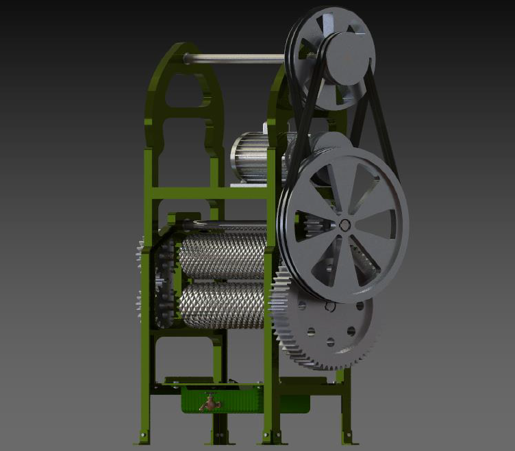

# Design and Analysis of a Conventional Sugarcane Juicer Machine

A comprehensive machine design, MATLAB-automated calculations, and ANSYS structural analysis project for a commercial sugarcane juicer system.

---

## Project Overview
* **Objective:** Design and validate a compact, efficient roadside sugarcane juicer machine capable of handling commercial daily workloads[cite: 34].
* **Core Systems:** Electric motor drive ($1.4\text{ HP}$, $630\text{ rpm}$), multi-stage pulley and gear reduction systems, crushing rollers, and a structural support frame[cite: 16, 17, 23].
* **Key Tools:** SolidWorks (CAD modeling), ANSYS (Static Structural FEA), MATLAB (Automated Gear Design and Calculations)[cite: 17, 19, 24].

---

## Key Specifications & Performance
* **Machine Dimensions:** Height: $1.2\text{ m}$, Breadth: $0.35\text{ m}$, Length: $0.5\text{ m}$[cite: 23].
* **Capacity & Yield:** Processes $20\text{ kg/hour}$ with an average juice yield of $250\text{ ml/kg}$[cite: 34].
* **Daily Throughput:** Estimated output of $98\text{ cups}$ ($24.5\text{ liters}$) over a $7\text{ hour}$ working day at $70\%$ operational efficiency[cite: 34].

---

## Engineering Methodology

1. **Power Transmission & Layout:**
   * Designed a multi-stage reduction using a 3-phase electric motor connected via pulley systems and gear trains (spur and pinion gears) to achieve high crushing torque at the rollers[cite: 16, 17].
   * Developed automated **MATLAB scripts** to handle iterative gear sizing, module calculations, and stress validations without manual hand-calculation bottlenecks[cite: 24].

2. **Structural & FEA Analysis (ANSYS):**
   * Conducted static structural analyses on the structural steel side walls, gear teeth, and roller shafts under simulated loading and motor torque moments[cite: 19, 27].
   * **Factor of Safety (FOS):** Maintained robust safety margins across components (e.g., FOS of $5.57$ on the main support structure and $15$ on gear/pulley subcomponents under exaggerated peak loads)[cite: 21, 27].

---

## Assembly Render

---

## Documentation & Repository Structure
* **[Download & View Full Project Report (PDF)](./DMS%20ASSIGNMENT%201-1.pdf)**: Complete documentation including detailed calculations, BOM, and ANSYS stress/deformation contour plots.
* `CAD.png`: Isometric assembly render of the machine.
